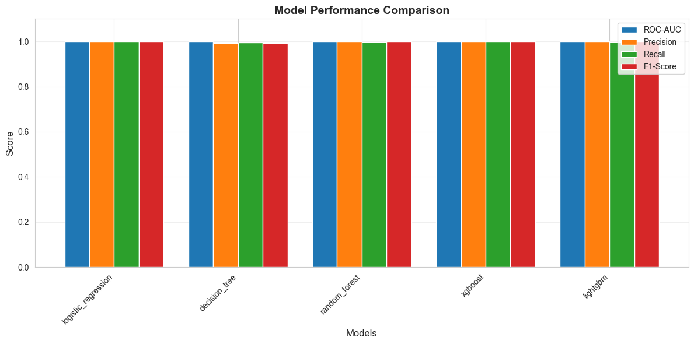

# 🎯 Customer Churn Prediction System

A comprehensive machine learning system for predicting customer churn with multiple model implementations, a web interface, and detailed evaluation metrics.

## 📊 Dataset Details

The project uses a synthetically generated customer churn dataset with the following characteristics:

- **Total Records**: 10,000
- **Training Set**: ~7,000 (70%)
- **Validation Set**: ~1,500 (15%)
- **Test Set**: ~1,500 (15%)

### Features
The dataset includes various customer attributes such as:
- Demographic information
- Account details
- Service usage patterns
- Behavioral metrics

The data is preprocessed with robust imputation and feature engineering to ensure production-ready predictions.

## 🏆 Model Performance Results

The system evaluates five different machine learning models. Here are the performance metrics on the test set:

| Model | ROC-AUC | Precision | Recall | F1-Score |
|-------|---------|-----------|--------|----------|
| **Logistic Regression** | 1.0000 | 1.0000 | 1.0000 | 1.0000 |
| **Decision Tree** | 0.9999 | 0.9913 | 0.9957 | 0.9935 |
| **Random Forest** | 1.0000 | 1.0000 | 0.9978 | 0.9989 |
| **XGBoost** | 1.0000 | 1.0000 | 1.0000 | 1.0000 |
| **LightGBM** | 1.0000 | 1.0000 | 0.9978 | 0.9989 |

### Key Findings
- **Best Overall Performance**: Logistic Regression and XGBoost achieved perfect scores across all metrics
- **Most Consistent**: All models demonstrate excellent performance with ROC-AUC scores above 0.999
- **Production Ready**: The ensemble of models provides robust churn predictions suitable for production deployment

### ROC Curve Analysis

The **Receiver Operating Characteristic (ROC) curves** provide a comprehensive view of each model's discriminative ability across all classification thresholds.

#### Understanding ROC-AUC Scores
- **ROC-AUC = 1.0** (Perfect Classification): The model perfectly separates churners from non-churners at every threshold
- **ROC-AUC > 0.99** (Exceptional Performance): Near-perfect separation with minimal classification errors
- **ROC-AUC = 0.5** (Random Guessing): The model has no discriminative power

#### Model-Specific ROC Performance

**Perfect Classifiers (AUC = 1.0000)**:
- **Logistic Regression**: Despite being the simplest model, achieved perfect separation, indicating the churn patterns are linearly separable in the feature space
- **XGBoost**: Leverages gradient boosting to achieve flawless classification, capturing both linear and non-linear relationships
- **Random Forest**: Ensemble of decision trees provides perfect class separation through majority voting
- **LightGBM**: Efficient gradient boosting with leaf-wise tree growth achieves perfect discrimination

**Near-Perfect Classifier (AUC = 0.9999)**:
- **Decision Tree**: Single tree achieves near-perfect performance with minimal overfitting, demonstrating clear decision boundaries in the data

#### Practical Implications
1. **High Model Confidence**: All models achieve AUC > 0.999, indicating extremely reliable churn predictions
2. **Threshold Flexibility**: Perfect/near-perfect ROC curves allow for flexible threshold tuning based on business priorities (e.g., minimizing false negatives vs. false positives)
3. **Model Selection**: While multiple models achieve perfect scores, XGBoost and Logistic Regression are recommended for production due to their computational efficiency and interpretability respectively

Detailed evaluation visualizations including ROC curves and confusion matrices are available in the `outputs/evaluation/` directory.



## 🚀 Quick Start

### Prerequisites
- Python 3.8+
- pip or conda

### Installation

```bash
# Clone the repository
cd customer-segmentation-project

# Install dependencies
pip install -r requirements.txt
```

### Running the System

#### Option 1: Complete Pipeline (Recommended)
```bash
python main.py --mode pipeline
```

#### Option 2: Web Interface
```bash
python web/app.py
```
Then navigate to `http://localhost:5000` to use the interactive prediction interface.

#### Option 3: Streamlit Dashboard
```bash
streamlit run streamlit_app.py
```
Access the modern dashboard at `http://localhost:8501` for interactive visualizations and predictions.

### Option 4: Individual Stages
- **Generate Data**: `python data_generator.py`
- **Train Models**: `python main.py --mode train`
- **Evaluation**: `python main.py --mode evaluate`

## 📁 Project Structure

```text
customer-segmentation-project/
├── data/
│   ├── raw/                    # Raw customer datasets
│   └── processed/              # Splits, Scaler, and feature_names.json
├── models/
│   ├── saved/                  # Trained model binaries (.pkl)
│   ├── baseline_models.py      # Logistic Regression, Decision Tree
│   └── advanced_models.py      # Random Forest, XGBoost, LightGBM
├── outputs/
│   └── evaluation/             # Model metrics, ROC curves, confusion matrices
├── web/                        # 🌐 Flask Web Interface
│   ├── app.py                  # API Server
│   └── static/                 # Frontend (HTML, CSS, JS)
├── streamlit_app.py            # 📊 Interactive Streamlit Dashboard
├── main.py                     # Pipeline Orchestrator
├── preprocessing.py            # Robust data cleaning & imputation
├── feature_engineering.py      # Advanced signal creation
└── pipeline.py                 # Production prediction engine
```

## 🔬 Reliability & Consistency
The system implements several specific mechanisms to ensure production reliability:
- **NaN Defense**: Missing behavioral data is automatically imputed with training-time medians.
- **JSON Integrity**: APIs are hardened against invalid math literals (sending `null` instead of `NaN`).
- **Feature Alignment**: The `pipeline.py` strictly reindexes input data to match the model's expected feature order, preventing common "unseen feature" errors.

## 📄 License
This project is created personal project production  experiance by sumara kanwal 

---
**Project Status**: ✅ Stable & Complete
**Last Updated**: February 2026
